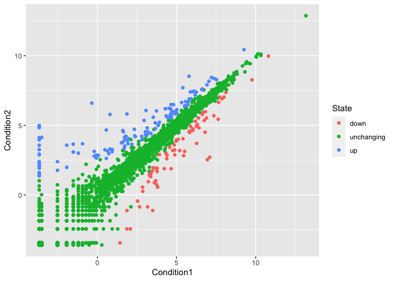

Class 05: Data Visulaization with GGPLOT
================
Jada Ruiz

# Our first ggplot

To use the ggplot2 package I first need to have it installed on my
computer.

To install any package we use the ‘install.packages()’ command.

Now can we use it? NO! We need first call ‘library(ggplot2)’.

``` r
library(ggplot2)
ggplot()
```


``` r
mpg
```

    # A tibble: 234 × 11
       manufacturer model      displ  year   cyl trans drv     cty   hwy fl    class
       <chr>        <chr>      <dbl> <int> <int> <chr> <chr> <int> <int> <chr> <chr>
     1 audi         a4           1.8  1999     4 auto… f        18    29 p     comp…
     2 audi         a4           1.8  1999     4 manu… f        21    29 p     comp…
     3 audi         a4           2    2008     4 manu… f        20    31 p     comp…
     4 audi         a4           2    2008     4 auto… f        21    30 p     comp…
     5 audi         a4           2.8  1999     6 auto… f        16    26 p     comp…
     6 audi         a4           2.8  1999     6 manu… f        18    26 p     comp…
     7 audi         a4           3.1  2008     6 auto… f        18    27 p     comp…
     8 audi         a4 quattro   1.8  1999     4 manu… 4        18    26 p     comp…
     9 audi         a4 quattro   1.8  1999     4 auto… 4        16    25 p     comp…
    10 audi         a4 quattro   2    2008     4 manu… 4        20    28 p     comp…
    # … with 224 more rows

Our first plot of displ vs hwy All ggplot() graphs are made in the same
way:

- data + aesthetics + geoms

``` r
ggplot(mpg) + aes(x=displ, y=hwy) + geom_point()
```


``` r
ggplot(mpg) + aes(x=displ, y=hwy) + geom_point() + geom_smooth(method= lm, se=FALSE) 
```

    `geom_smooth()` using formula = 'y ~ x'


# Plot of gene expression data

First read the data from online.

``` r
url <- "https://bioboot.github.io/bimm143_S20/class-material/up_down_expression.txt"
genes <- read.delim(url)
head(genes)
```

            Gene Condition1 Condition2      State
    1      A4GNT -3.6808610 -3.4401355 unchanging
    2       AAAS  4.5479580  4.3864126 unchanging
    3      AASDH  3.7190695  3.4787276 unchanging
    4       AATF  5.0784720  5.0151916 unchanging
    5       AATK  0.4711421  0.5598642 unchanging
    6 AB015752.4 -3.6808610 -3.5921390 unchanging

> Q. How many genes are in this dataset? 5196 genes

What are the colnames?

``` r
colnames(genes)
```

    [1] "Gene"       "Condition1" "Condition2" "State"     

A first version plot of this data Condition1 vs Condition2.

``` r
p <- ggplot(genes) + aes(x=Condition1, y=Condition2, col=State) + geom_point() 
p
```



> Q. How many genes are upregulated and down regulated?

``` r
head(genes)
```

            Gene Condition1 Condition2      State
    1      A4GNT -3.6808610 -3.4401355 unchanging
    2       AAAS  4.5479580  4.3864126 unchanging
    3      AASDH  3.7190695  3.4787276 unchanging
    4       AATF  5.0784720  5.0151916 unchanging
    5       AATK  0.4711421  0.5598642 unchanging
    6 AB015752.4 -3.6808610 -3.5921390 unchanging

To get at just the State column:

``` r
table(genes$State)
```


          down unchanging         up 
            72       4997        127 

``` r
table( c("bimm143", "help", "me", "bimm143"))
```


    bimm143    help      me 
          2       1       1 

You can save a ggplot underneath a variable and then recall it and add
more to the plot that way without a big long chunk of code.

``` r
p + scale_colour_manual( values=c("blue","gray","red") ) + labs(title = "My nice title", x="No drug", y="Drug")
```


