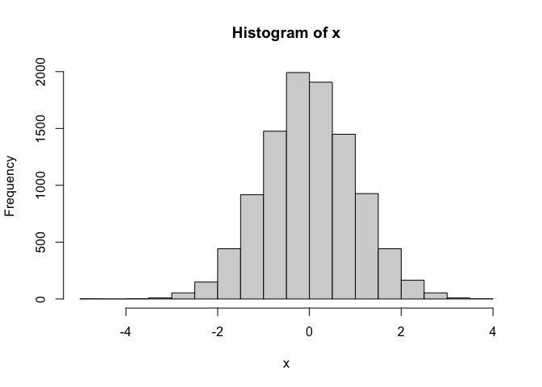
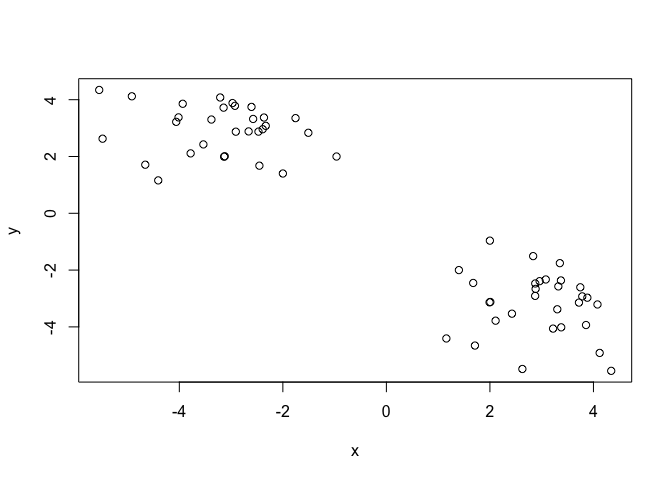
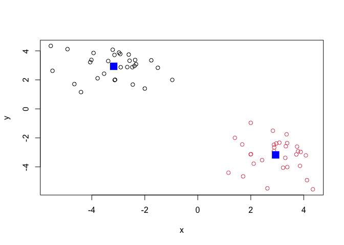
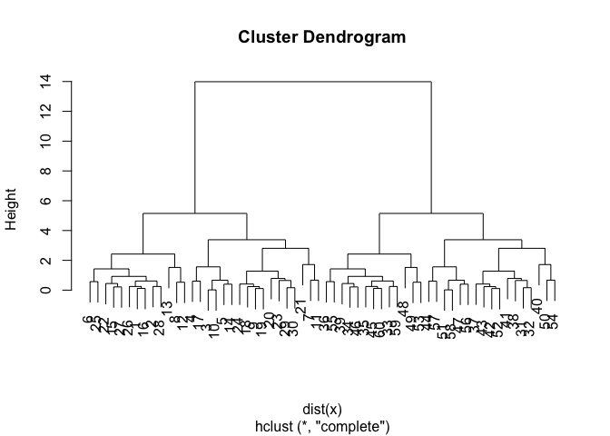
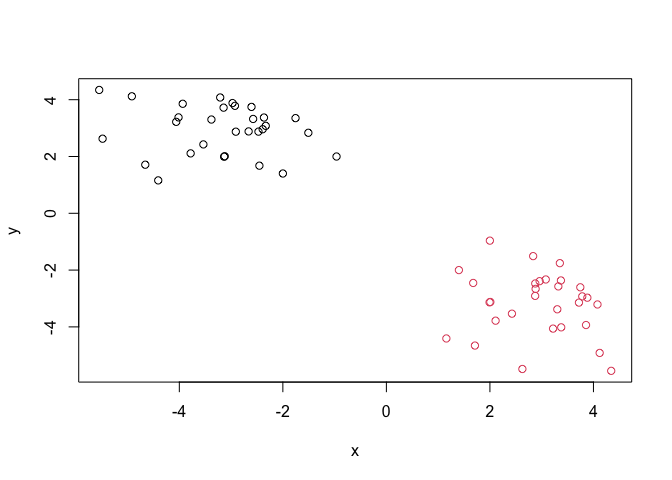
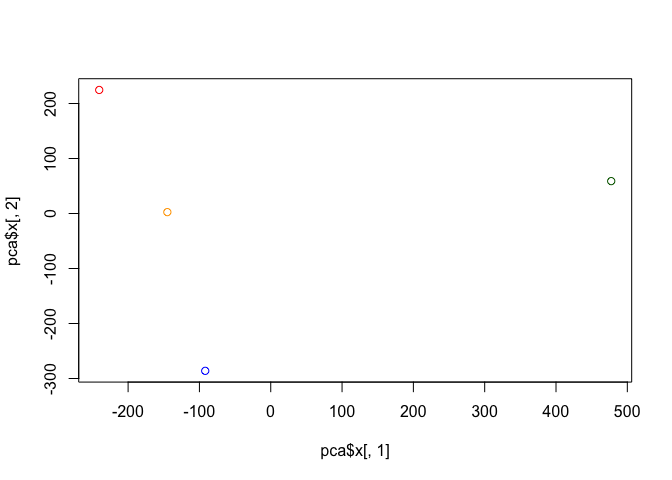
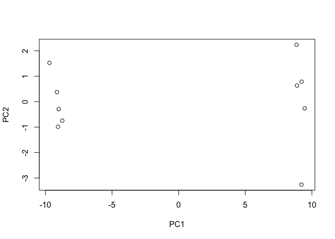

Class 7 Machine Learning 1
================
Jada Ruiz

# K-means Clustering

First we will test how this method works in R with some made up data.

``` r
x <- rnorm(10000)
hist(x)
```



Let’s make some numbers centered upon -3.

``` r
tmp <- c(rnorm(30, -3), rnorm(30, +3))

x <- cbind(x=tmp, y=rev(tmp))
plot(x)
```



Now lets see how `kmeans()` works with this data…

``` r
km <- kmeans(x, center=2, nstart=20)
km
```

    K-means clustering with 2 clusters of sizes 30, 30

    Cluster means:
              x         y
    1 -3.173870  2.936264
    2  2.936264 -3.173870

    Clustering vector:
     [1] 1 1 1 1 1 1 1 1 1 1 1 1 1 1 1 1 1 1 1 1 1 1 1 1 1 1 1 1 1 1 2 2 2 2 2 2 2 2
    [39] 2 2 2 2 2 2 2 2 2 2 2 2 2 2 2 2 2 2 2 2 2 2

    Within cluster sum of squares by cluster:
    [1] 57.16162 57.16162
     (between_SS / total_SS =  90.7 %)

    Available components:

    [1] "cluster"      "centers"      "totss"        "withinss"     "tot.withinss"
    [6] "betweenss"    "size"         "iter"         "ifault"      

``` r
km$center
```

              x         y
    1 -3.173870  2.936264
    2  2.936264 -3.173870

> Q. How many points are in each cluster?

``` r
km$size
```

    [1] 30 30

> Q. What ‘components’ of your result object details - cluster
> assignment/membership? - cluster center?

``` r
km$cluster
```

     [1] 1 1 1 1 1 1 1 1 1 1 1 1 1 1 1 1 1 1 1 1 1 1 1 1 1 1 1 1 1 1 2 2 2 2 2 2 2 2
    [39] 2 2 2 2 2 2 2 2 2 2 2 2 2 2 2 2 2 2 2 2 2 2

``` r
km$centers
```

              x         y
    1 -3.173870  2.936264
    2  2.936264 -3.173870

> Q. Plot x colored by the kmeans cluster assignment and add cluster
> centers as blue points.

``` r
plot(x, col=km$cluster)
points(km$centers, col="blue", pch=15, cex=2)
```



# Hierarchial Clustering

The `hclust()` function in R performs hierarchical clustering.

the `hclust` function requires an input distance matrix, which I can get
from the `dist()` fucntion.

``` r
hc <- hclust(dist(x))
hc
```


    Call:
    hclust(d = dist(x))

    Cluster method   : complete 
    Distance         : euclidean 
    Number of objects: 60 

There is a plot() method for hclust objects…

``` r
plot(hc)
```



Now to get my cluster membership vector I need to “cut” the tree to
yield separate “branches” with the “leaves” on each branch being out
cluster. To do this we use the `cutree()` function.

``` r
cutree(hc, h=8)
```

     [1] 1 1 1 1 1 1 1 1 1 1 1 1 1 1 1 1 1 1 1 1 1 1 1 1 1 1 1 1 1 1 2 2 2 2 2 2 2 2
    [39] 2 2 2 2 2 2 2 2 2 2 2 2 2 2 2 2 2 2 2 2 2 2

Use `cutree()` with a k=2.

``` r
grps <- cutree(hc, k=2)
```

A plot of our data colored by our hclust grps.

``` r
plot(x, col=grps)
```



# Principal Component Analysis (PCA)

``` r
url <- "https://tinyurl.com/UK-foods"
x <- read.csv(url)
x
```

                         X England Wales Scotland N.Ireland
    1               Cheese     105   103      103        66
    2        Carcass_meat      245   227      242       267
    3          Other_meat      685   803      750       586
    4                 Fish     147   160      122        93
    5       Fats_and_oils      193   235      184       209
    6               Sugars     156   175      147       139
    7      Fresh_potatoes      720   874      566      1033
    8           Fresh_Veg      253   265      171       143
    9           Other_Veg      488   570      418       355
    10 Processed_potatoes      198   203      220       187
    11      Processed_Veg      360   365      337       334
    12        Fresh_fruit     1102  1137      957       674
    13            Cereals     1472  1582     1462      1494
    14           Beverages      57    73       53        47
    15        Soft_drinks     1374  1256     1572      1506
    16   Alcoholic_drinks      375   475      458       135
    17      Confectionery       54    64       62        41

> Q1. How many rows and columns are in your new data frame named x? What
> R functions could you use to answer this questions?

``` r
dim(x)
```

    [1] 17  5

There are 17 rows and 4 columns in the data frame, and you can use dim()
to figure this out.

Preview first 6 rows:

``` r
head(x)
```

                   X England Wales Scotland N.Ireland
    1         Cheese     105   103      103        66
    2  Carcass_meat      245   227      242       267
    3    Other_meat      685   803      750       586
    4           Fish     147   160      122        93
    5 Fats_and_oils      193   235      184       209
    6         Sugars     156   175      147       139

We want to fix columns, as there should be 5, make row names the first
column.

``` r
rownames(x) <- x[,1]
x <- x[,-1]
head(x)
```

                   England Wales Scotland N.Ireland
    Cheese             105   103      103        66
    Carcass_meat       245   227      242       267
    Other_meat         685   803      750       586
    Fish               147   160      122        93
    Fats_and_oils      193   235      184       209
    Sugars             156   175      147       139

Lets check number of rows and columns again.

``` r
dim(x)
```

    [1] 17  4

> Q2. Which approach to solving the ‘row-names problem’ mentioned above
> do you prefer and why? Is one approach more robust than another under
> certain circumstances?

I prefer the second approach more because it is directly deriving from
the original data frame and not from x which gets rewritten every time
you run the code “x \<- x\[,-1\]” multiple times. You’ll lose the first
column every time you rerun that code.

Now, lets look at differences and trends of graphs.

``` r
barplot(as.matrix(x), beside=T, col=rainbow(nrow(x)))
```


> Q3: Changing what optional argument in the above barplot() function
> results in the following plot?

``` r
barplot(as.matrix(x), beside=F, col=rainbow(nrow(x)))
```


Changing the beside to “F” (false) results in the type of plot above.

> Q5: Generating all pairwise plots may help somewhat. Can you make
> sense of the following code and resulting figure? What does it mean if
> a given point lies on the diagonal for a given plot?

``` r
pairs(x, col=rainbow(10), pch=16)
```


This type of plot above compares each region with one another and the
categories given in the data frame. If a point falls on a diagonal line
that means the values between each region within that category is quite
similar to one another.

While this is kind of useful it takes work to dig into the details here
to find out what is different in these countries.

> Q6. What is the main differences between N. Ireland and the other
> countries of the UK in terms of this data-set?

N. Ireland typically has lower values for these categories compared to
the other countries. Meaning that on the plots, N. Ireland has more
outliers compared to other countries.

## PCA to the rescue

Principal Component Analysis (PCA for short) can be a big help in these
cases where we have lot’s of things that are being measured in a data
set.

The main PCA function in base R is ‘prcomp()’.

The ‘prcomp()’ function wants aw input the transpose of our
matrix/table/data.frame

``` r
pca <- prcomp(t(x))
summary(pca)
```

    Importance of components:
                                PC1      PC2      PC3       PC4
    Standard deviation     324.1502 212.7478 73.87622 4.189e-14
    Proportion of Variance   0.6744   0.2905  0.03503 0.000e+00
    Cumulative Proportion    0.6744   0.9650  1.00000 1.000e+00

The above results shows that PCA captures 67% of the total variance in
the original data in one PC and 96.5% in two PCs.

``` r
attributes(pca)
```

    $names
    [1] "sdev"     "rotation" "center"   "scale"    "x"       

    $class
    [1] "prcomp"

``` r
pca$x
```

                     PC1         PC2         PC3           PC4
    England   -144.99315    2.532999 -105.768945  2.842865e-14
    Wales     -240.52915  224.646925   56.475555  7.804382e-13
    Scotland   -91.86934 -286.081786   44.415495 -9.614462e-13
    N.Ireland  477.39164   58.901862    4.877895  1.448078e-13

> Q7. Complete the code below to generate a plot of PC1 vs PC2. The
> second line adds text labels over the data points. Q8. Customize your
> plot so that the colors of the country names match the colors in our
> UK and Ireland map and table at start of this document.

Lets plot our main results.

``` r
plot(pca$x[,1], pca$x[,2], col=c("orange", "red", "blue", "darkgreen"))
```



> Q9: Generate a similar ‘loadings plot’ for PC2. What two food groups
> feature prominantely and what does PC2 maninly tell us about?

``` r
par(mar=c(10, 3, 0.35, 0))
barplot( pca$rotation[,2], las=2 )
```


Soft drinks and fresh potatoes are the most predominant categories. This
mainly tells us that one country consumes more fresh potatoes while the
other country consumes more soft drinks.

# 2. PCAof RNA-seq Data

``` r
url2 <- "https://tinyurl.com/expression-CSV"
rna.data <- read.csv(url2, row.names=1)
head(rna.data)
```

           wt1 wt2  wt3  wt4 wt5 ko1 ko2 ko3 ko4 ko5
    gene1  439 458  408  429 420  90  88  86  90  93
    gene2  219 200  204  210 187 427 423 434 433 426
    gene3 1006 989 1030 1017 973 252 237 238 226 210
    gene4  783 792  829  856 760 849 856 835 885 894
    gene5  181 249  204  244 225 277 305 272 270 279
    gene6  460 502  491  491 493 612 594 577 618 638

> Q10: How many genes and samples are in this data set?

``` r
dim(rna.data)
```

    [1] 100  10

There are 100 genes and 10 samples.

Now PCA:

``` r
pca <- prcomp(t(rna.data), scale=TRUE)
plot(pca$x[,1], pca$x[,2], xlab="PC1", ylab="PC2")
```


